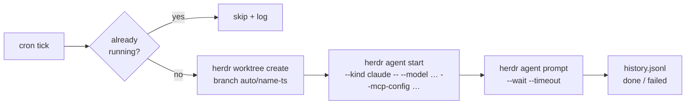

# herdr-automations

**Scheduled tasks for your coding agents.** A prompt, a cron line, and a fresh git worktree per run.

[](LICENSE)
[](go.mod)
[](https://herdr.dev)

```yaml
automations:
  - name: issue-triage
    cron: "0 9 * * 1-5"
    repo: ~/Projects/myapp
    model: sonnet
    prompt: |
      Triage new GitHub issues: label them, close duplicates,
      draft replies for the ones needing more info.
```


If you have used ChatGPT's Scheduled tasks, this is the same boundary — a prompt, a
schedule, a model, and a choice between an isolated worktree and the repo itself —
except it runs in your terminal, on your machine, against your repos, and the config
is one YAML file you can keep in git. Unlike agent schedulers that ship an account
and a webhook relay (Open Run, for one), nothing leaves the machine and nothing
installs outside the plugin.

Every weekday at 9:00, a Claude (or Codex, or opencode…) agent spawns in a fresh
worktree of `myapp`, gets that prompt, and works until it's done. You arrive to
triaged issues, a branch to review, and a run log.
[What it does to your machine](#what-this-does-to-your-machine) is stated outright.

## Why

[Herdr](https://herdr.dev) keeps your agents alive when you close the laptop — but
*you* still have to start them. Recurring chores — issue triage, nightly flake hunts,
a Friday digest — deserve better than you retyping the same prompt every morning.

## Highlights

- **Every run is a branch you can review** — `auto/<name>-<timestamp>` in a fresh worktree, so a run that went sideways is a diff you throw away, not a mess in your working copy. `workspace: root` when the task must see uncommitted state, `workspace: existing` when a run an hour would bury the sidebar
- **One YAML file** — no DSL, no store, no database. What the plugin knows is the file you wrote plus an append-only run log
- **Installs without a toolchain** — prebuilt, checksum-verified binaries for macOS and Linux (arm64/amd64)
- **`model:` per automation** — a nightly chore has no business on your most expensive model. Set it where you read it; a kind that takes no `--model` is caught when the file loads, not at 3am
- **Survives sleep** — occurrences are computed off the wall clock, so a run due while the laptop slept fires on wake (within `catch_up_minutes`) instead of vanishing; anything too late is recorded as `missed`
- **Schedules that overlap say so** — the wizard warns while you are still choosing the cron, and `list` reports every overlap in the week ahead. Herdr starts them all; the plugin never quietly holds one back, it just makes sure you knew
- **Overlap guard** — a tick that fires while *that same* automation is still working is skipped, never queued into a pile-up
- **Agent-agnostic** — anything `herdr agent start` supports: `claude`, `codex`, `opencode`, `gemini`, `cursor`, …
- **MCP attach** — `mcp_config: path.json` hands the agent its MCP servers (GitHub, Slack, your DB…)
- **Full run history** — append-only JSONL: `scheduled → running → done | failed | skipped | missed`, with workspace and pane IDs to jump back into
- **Self-updating daemon** — it re-executes itself when the plugin binary changes, and a PID lock keeps a second scheduler from double-firing everything
- **Live board** — an overlay pane inside Herdr: next run, last status, `r` to run now, `enter` to jump straight into the workspace a run created
- **Agents can self-schedule** — a bundled [skill](skills/creating-automations/SKILL.md) teaches Claude Code the format: say *"triage my errors every morning"* and the agent writes the entry itself
- **A failure finds you** — a run that fails, a run that's missed, or a broken entry raises a Herdr toast; everything else stays quiet

## What it isn't

**An automation is one prompt on a clock.** Not a sequencer, not a workflow engine,
not a place to put branching logic. One prompt, one schedule, one run.

**No store, no daemon to install, no state you can't read.** Two files: your
`automations.yaml`, and `history.jsonl`. Uninstalling leaves both behind.

**Nothing happens that the file doesn't say.** The scheduler doesn't queue, throttle,
stagger or clean up behind your back. Where that could surprise you — overlapping
schedules, accumulating worktrees — it reports and waits for you.

## Quick start

```bash
herdr plugin install DnzzL/herdr-automations   # prebuilt binary, no toolchain needed
herdr-automations add                          # wizard: validates cron, previews next 3 runs
```

Prebuilt for macOS and Linux (arm64/amd64), checksum-verified at install; anything
else builds from source and needs Go.

**Three ways to add an automation**, all writing the same file:

1. `herdr-automations add` — the wizard: validates the cron, previews the next three
   runs, and warns if another automation is already due at the same time

   

2. **Edit the YAML** — `herdr plugin config-dir dnzzl.automations` → `automations.yaml`
   (or press `e` on the board to open it at the right line). Full reference in
   [`automations.example.yaml`](automations.example.yaml)
3. **Ask your agent** — see below

The daemon picks up edits within 30 seconds, no restart.

```bash
herdr-automations list             # schedule, model and last run per automation
herdr-automations run issue-triage # trigger now, don't wait for cron
herdr-automations history         # what ran, when, how it ended
herdr-automations cleanup         # drop the run worktrees whose work already landed
```

### Let your agent do the scheduling

The plugin ships a skill that teaches coding agents this file format. Agents only
discover skills under `~/.claude/skills`, so install it once:

```bash
herdr-automations install-skill      # symlinks into ~/.claude/skills
```

Then, in any new agent session, plain language is enough:

> *"Every Monday at 9am, review the open PRs and tickets on myapp and propose a sprint."*

> *"Every weekday morning, triage the new errors and file the real ones as tickets."*

> *"Stop the flaky-hunt automation for now."*

The agent writes the YAML entry, and the daemon picks it up within 30 seconds. It's
a symlink, so plugin upgrades update the skill too.

### The board, inside Herdr

A live overlay listing every automation with its next run and last status:

```bash
herdr plugin pane open --plugin dnzzl.automations --entrypoint board --placement overlay
```

| Key | Does |
|---|---|
| `enter` | **Jump to the last run** — focuses the workspace that automation spawned, so you land right in the agent's terminal |
| `r` | Run the selected automation now |
| `e` | Open `automations.yaml` in `$EDITOR`, **cursor on that automation's line** |
| `c` | Clean up the run worktrees whose work already landed — it counts them, asks `y/n`, and touches nothing else |
| `j` / `k` | Move · `q` closes |

Bind it to a chord so you never type that command again — in `~/.config/herdr/config.toml`:

```toml
[[keys.command]]
key = "prefix+a"
type = "shell"
command = "herdr plugin pane open --plugin dnzzl.automations --entrypoint board --placement overlay"
```

The plugin also registers an action (`herdr plugin action invoke run-now --plugin dnzzl.automations`)
that prompts for which automation to fire.

## How a run works



Everything goes through the `herdr` CLI — the same socket API agents themselves use. No private hooks, nothing to break on Herdr upgrades.

## Full entry reference

```yaml
automations:
  - name: issue-triage            # unique, kebab-case
    cron: "0 9 * * 1-5"           # 5-field crontab, or @daily / @hourly / @weekly
    repo: ~/Projects/myapp
    workspace: worktree           # worktree (default) | root | existing
    agent: claude                 # any `herdr agent start --kind`
    model: sonnet                 # optional → --model; kinds without the flag are caught on load
    prompt: "…"                   # OR workflow: <name>  (delegates to hwf run)
    mcp_config: ~/.config/mcp/github.json   # optional → --mcp-config
    agent_args: ["--verbose"]               # optional, verbatim agent flags
    timeout_minutes: 60           # optional bound on the run
    catch_up_minutes: 120         # how late a sleep-delayed run may still start; -1 never
    disabled: true                # optional: keep it, don't schedule it
```


### Run in a shared workspace

Create a workspace once with `herdr workspace create --label Automations --no-focus`,
or find an existing one with `herdr workspace list`. Use its returned ID:

```yaml
automations:
  - name: daily-summary
    cron: "@daily"
    repo: ~/Projects/myapp
    workspace: existing
    workspace_id: w7              # replace with your workspace's ID
    agent: claude
    prompt: "Summarize recent changes."
```

Point several automations at the same `workspace_id` to collect their runs in one
space. Each run opens a fresh tab labeled with its automation name and timestamp,
uses `repo` as its working directory, and leaves your focus unchanged. Earlier tabs
remain open for review; each run gets a distinct agent name.

Like `root`, this mode works directly in `repo` and creates no Git worktree. Runs
sharing a directory can see each other's file changes. `workspace_id` is required
only for `existing` mode and belongs to the Herdr session running the daemon. If
you close that workspace, runs fail until you update the ID; the plugin does not
create a replacement — see [ADR 0009](docs/adr/0009-a-run-may-share-a-workspace.md).
The `add` wizard also offers this mode.

## What this does to your machine

`herdr-automations` schedules and records. It never runs your prompt itself: it asks
Herdr to provision a workspace or tab and start an agent, and that agent runs under whatever
permissions Herdr gives it. So the honest statement is about the scheduler, and the
agent's own posture is Herdr's to describe.

- **Writes to two places** — the plugin config dir (`herdr plugin config-dir dnzzl.automations`) and `~/.local/state/herdr/plugins/dnzzl.automations` for the run log. Nothing else on disk is touched by the plugin itself
- **Creates git worktrees and branches** in the repos you name, `auto/<name>-<timestamp>`. It never removes one on its own — `herdr-automations cleanup` is the only thing that deletes, it asks first, and it only touches `auto/` branches already contained in your default branch
- **Opens no ports**, phones nothing home, and downloads nothing at runtime — the only network access is `herdr plugin install` fetching a checksum-verified release binary
- **Raises a Herdr toast** on a failed run, a missed run, or a broken `automations.yaml` entry — in-session only: a panel inside the Herdr window, not an OS notification, and not sent anywhere
- **`herdr plugin uninstall`** removes the plugin and leaves your config and history where they are

## FAQ

**Does my machine need to be awake?** For the run to start, yes — and laptops sleep.
So the scheduler works off the wall clock, not a timer: an occurrence that came due
while the machine was asleep **runs when it wakes**, as long as it's within
`catch_up_minutes` (default 2 hours). Anything older is recorded as `missed` in the
history rather than silently skipped, so `herdr-automations history` always tells you
what didn't happen. Set `catch_up_minutes: -1` for automations that are pointless late.

Timers alone don't survive sleep — macOS suspends the monotonic clock, so a job armed
for 9am Monday can simply never fire. Hence the wall-clock loop.

**Two automations due at the same minute — what runs?** Both. Herdr is a multi-agent
runtime and `0 9 * * 1` means 9:00, so the scheduler doesn't queue, throttle or
quietly stagger anything behind your back. What it does instead is tell you: the
wizard warns while you're still choosing the cron, and `herdr-automations list`
reports every overlap in the next week. If running them together isn't what you
want, move a cron — one character, and the file still says what happens.

**What happens to the tabs `workspace: existing` opens?** Same answer, one level
down: they accumulate, and nothing reaps them. A tab you have read is a tab you
close. `cleanup` has nothing to say about them — there is no worktree and no
branch, so the only trace a run leaves is its line in `history.jsonl`.

**What happens to the worktrees?** They accumulate on purpose: a run whose workspace
is still open is a run nobody has looked at, which makes the Herdr sidebar the inbox.
Closing it is how you say you're done.

`herdr-automations cleanup` removes only the ones whose work already landed — the
branch is an ancestor of the default branch, so either it was merged or the agent
produced no commit at all. Anything with a workspace still open, or commits that
exist nowhere else, is kept and told why. It prints its verdicts, asks once, and
neither the worktree nor the branch is removed by force: git refuses a dirty
checkout and refuses an unmerged branch, and those refusals are worth more than
the tidiness. **It never runs on a schedule** — a reaper would delete the very
signal that says which runs still want you.

**What about multi-step chores?** An automation is one prompt on a clock. If your
chore is a sequence, put the sequence in a
[herdr-workflows](https://github.com/aorumbayev/herdr-workflows) workflow and
schedule it with `workflow: <name>` instead of `prompt:`. The run waits for the
workflow and fails when it does, and it refuses to start at all when `hwf` isn't
installed.

**Event triggers? On push, on PR?** No, and not planned. Herdr's plugin manifest does
support `[[events]]`, but the full list, as of Herdr 0.8.2, is workspace lifecycle and
nothing else: `worktree.created`, `worktree.removed`, `workspace.created`,
`workspace.closed`, `workspace.focused`, `workspace.renamed`, `workspace.updated`,
`pane.created`, `pane.closed`, `pane.exited`, `pane.focused`, `pane.updated`,
`tab.created`, `tab.closed`, `tab.focused`, `tab.renamed`, `layout.updated`. There is
no git event, no push, no pull request, and no webhook endpoint. Turning a GitHub push
into a local run means something hosted in the middle holding your repo names and
listening for the hook, which is the opposite of the two paragraphs above. If you want
work to happen on push, your forge's CI is already there. If you want it locally, a
cron automation that polls and does nothing when there is nothing new (`gh pr list`,
`git fetch`) is one entry in this file. See [ADR 0008](docs/adr/0008-no-event-triggers.md)
for the full reasoning.

An automation is one prompt on a clock. That is the whole boundary.

## Development

```bash
go build -o bin/herdr-automations . && go test ./...
herdr plugin link .        # use your checkout as the installed plugin
```

PRs welcome — especially agent kinds tested in the wild, cleanup policies, and notification shapes.

## License

[MIT](LICENSE)
